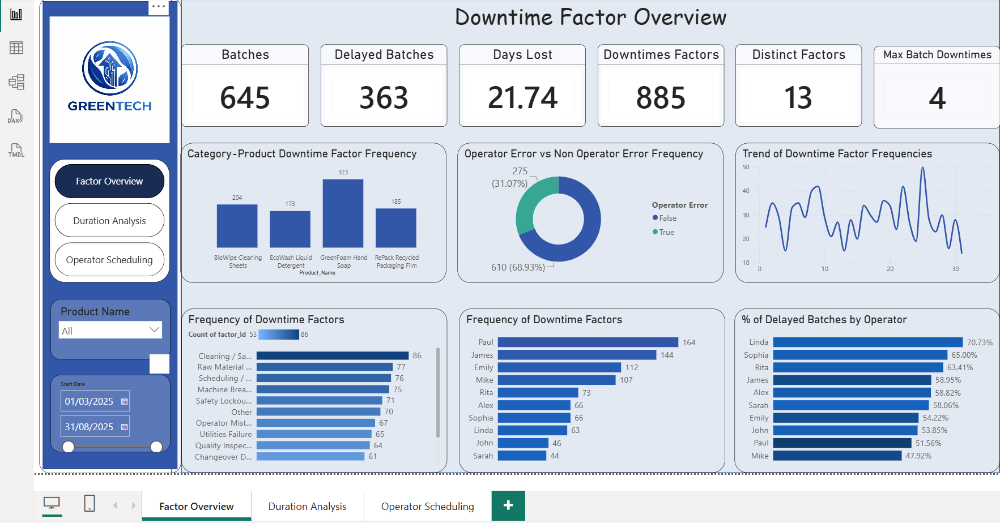
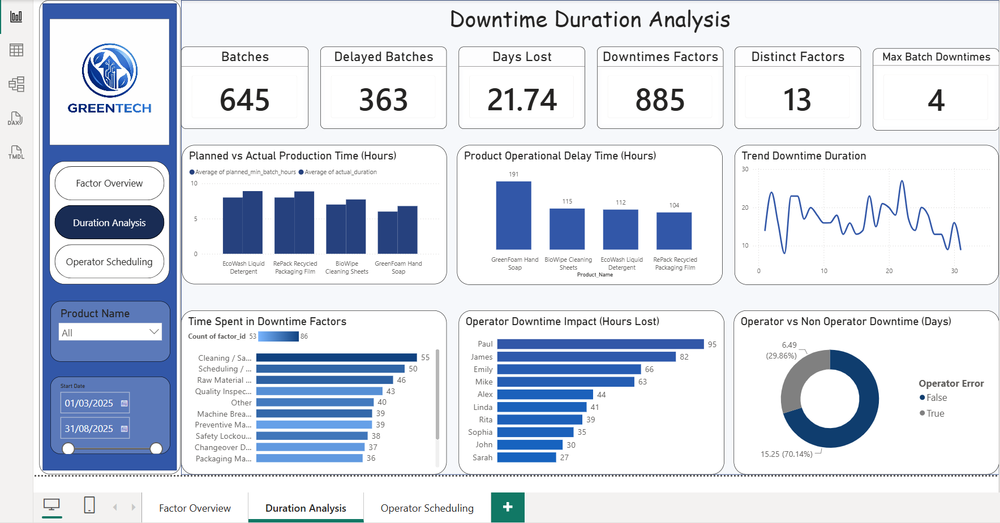
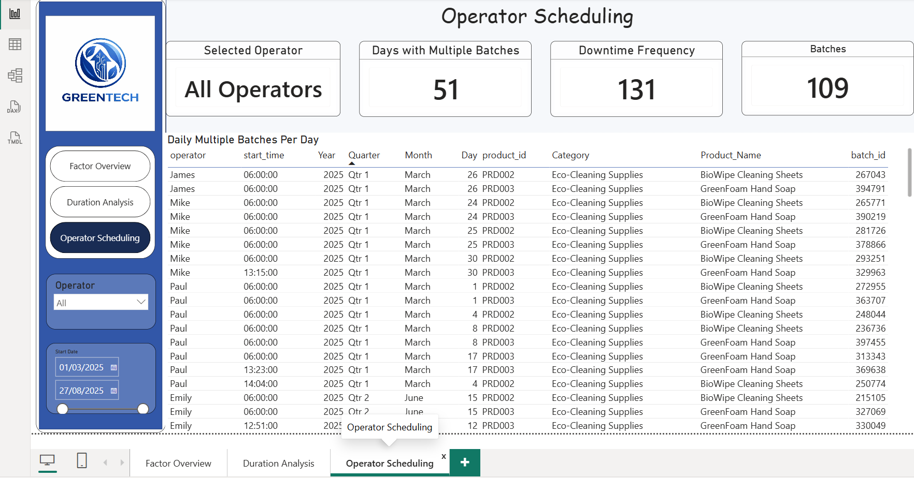

# GreenTech Manufacturing — Production Downtime Analysis

SQL Server and Power BI analysis of unplanned production downtime for an eco-products manufacturer. Four raw tables, 645 production batches, and a question management could not answer: where is the downtime actually coming from.

> Portfolio case study using a supplied SQL Server database. Data covers March to August 2025.



---

## Business Problem

GreenTech Manufacturing produces biodegradable cleaning products, recyclable packaging and energy-efficient appliances. The company had grown to $100M annual revenue, but production schedules were repeatedly disrupted by unplanned downtime, with an estimated $1.5M lost each year.

The problem was not that downtime existed. It was that nobody could see where it came from. Downtime was recorded across 13 separate factor columns in a wide table, disconnected from batch and operator data. Without restructuring it, no one could answer which causes were dominant, whether they were preventable, or who was affected.

The working assumption inside the business was that operator error and manual scheduling were the main drivers.

---

## Objectives

- Restructure the downtime data into an analysable format
- Identify the dominant causes of downtime by frequency and duration
- Separate operator-caused downtime from systemic causes
- Analyse downtime by product and by operator
- Build a Power BI dashboard for ongoing monitoring

---

## Dataset

| Table | Description | Key fields |
|---|---|---|
| `line_productivity_batches` | Production batch records | Batch_ID, Product_ID, Operator, Start_Time, End_Time, Planned_Min_Batch_Hours |
| `line_downtime` | Downtime minutes per batch | Batch_ID, Factor_1 to Factor_13 |
| `downtime_factors` | Factor reference table | Factor_ID, Factor_Name, Description, Operator_Error |
| `products` | Product reference table | Product_ID, Product_Name, Category, Min_Batch_Time |

645 batches, 885 recorded downtime events, 13 distinct downtime factors, 4 products, 10 operators.

---

## Approach

### 1. Assessment and null checks

Before transforming anything, I checked row counts and null distribution across all 13 factor columns, and validated that the `Date` column matched the date component of `Start_Time`.

```sql
-- Confirm no rows have all 13 factor columns null
SELECT COUNT(*) AS All_factors_null_count FROM line_downtime
WHERE COALESCE(Factor_1, Factor_2, Factor_3, Factor_4, Factor_5, Factor_6,
Factor_7, Factor_8, Factor_9, Factor_10, Factor_11, Factor_12, Factor_13) IS NULL;

-- Check whether Date and Start_Time disagree on any batch
WITH start_dates AS (
 SELECT Date, CAST(Start_Time AS DATE) AS Start_Date 
 FROM line_productivity_batches) 
SELECT * FROM start_dates
WHERE Date != Start_Date;
```

### 2. Restructuring the downtime table

The core transformation. Downtime sat in 13 wide columns, one per factor, which made it impossible to aggregate or join to the factor reference table. UNPIVOT converts those columns into rows, and stripping the `Factor_` prefix produces a `factor_id` that joins cleanly to `downtime_factors`.

```sql
CREATE VIEW downtimes AS 
SELECT Batch_ID, REPLACE(Factor, 'Factor_', '') as factor_id, Minutes 
FROM line_downtime
UNPIVOT(Minutes for factor in (Factor_1, Factor_2, Factor_3, Factor_4, Factor_5, Factor_6,
Factor_7, Factor_8, Factor_9, Factor_10, Factor_11, Factor_12, Factor_13)) AS Unpivotdowntimes;
```

This single view made every downstream query possible. 885 downtime events emerged from what had been an unusable wide table.

### 3. Building the batch production view

Separated date and time components, then calculated actual duration against planned duration to quantify overrun per batch.

```sql
CREATE VIEW batch_pd AS
  SELECT date as start_date, product_id, batch_id, operator, 
  CAST(end_time as date) as end_date,
  CAST(Start_time as time) as start_time, 
  CAST(end_time as time) as end_time, 
  planned_min_batch_hours,
  DATEDIFF(hour, start_time, end_time) as actual_duration, 
  DATEDIFF(hour, start_time, end_time) - Planned_Min_Batch_Hours as extra_time_hr
  FROM line_productivity_batches
```

### 4. The question that changed the answer

Management assumed operator error was the main driver. The `downtime_factors` table carries an `Operator_Error` flag, which meant the assumption could be tested directly rather than argued about.

```sql
SELECT 
  CASE operator_error
    WHEN 1 THEN 'yes'
    WHEN 0 THEN 'no'
  END AS operator_error,
  COUNT(batch_id) as frequency, 
  SUM(minutes) as delay_mins 
FROM downtimes
JOIN downtime_factors ON downtimes.factor_id = downtime_factors.Factor_ID
GROUP BY Operator_Error
```

**Result: 610 events (68.93%) were non-operator. 275 (31.07%) were operator-related.** The assumption was wrong, and the fix belonged somewhere else entirely.

### 5. Operator performance, measured properly

Counting downtime events per operator would have penalised whoever ran the most batches. Using `COUNT(DISTINCT ...)` on both sides produces the percentage of an operator's own batches that were delayed, which is comparable across different workloads.

```sql
SELECT Operator,
  COUNT(DISTINCT batch_pd.batch_id) as total_batches,
  COUNT(DISTINCT downtimes.Batch_ID) as number_of_delayed_batches,
  COUNT(downtimes.batch_id) as number_of_downtimes,
  SUM(minutes) as delay_mins,
  CAST((COUNT(DISTINCT downtimes.Batch_ID)*100.0)/(COUNT(DISTINCT batch_pd.batch_id)) 
    AS DECIMAL(10,2)) as percentage_delayed_batches
FROM batch_pd
LEFT JOIN downtimes ON batch_pd.batch_id = Downtimes.batch_id
GROUP BY operator
ORDER BY percentage_delayed_batches DESC
```

This distinction matters. Paul lost the most hours (95) across the most downtime events (164). Linda had the highest delay rate (70.73%) on fewer batches. Those are different problems requiring different responses.

Full query set: [`greentech-queries.sql`](greentech-queries.sql)

---

## Key Findings

### Downtime is systemic, not human

| Cause type | Events | Share |
|---|---|---|
| Non-operator | 610 | 68.93% |
| Operator | 275 | 31.07% |

Measured by duration rather than frequency, the split is 15.25 days against 6.49 days, or 70.14% non-operator. Both measures point the same way.

### The scale of the problem

| Metric | Value |
|---|---|
| Batches produced | 645 |
| Batches delayed | 363 (56%) |
| Days lost to downtime | 21.74 |
| Downtime events | 885 |
| Distinct factors | 13 |
| Maximum events in one batch | 4 |

More than half of all production runs experienced delay.

### Dominant causes

| Factor | Frequency |
|---|---|
| Cleaning / Sanitation Cycle | 86 |
| Raw Material Shortage | 77 |
| Scheduling / Coordination Delay | 76 |
| Machine Breakdown | 75 |
| Safety Lockout / Emergency Stop | 71 |

Three of the top four are process and supply issues, not operator behaviour.

### Product and operator patterns

GreenFoam Hand Soap carried the most downtime of any product at 323 events, and the highest operational delay time at 191 hours.

Paul, James and Emily lost the most total time (95, 82 and 66 hours). Linda, Sophia and Rita had the highest proportion of their own batches delayed (70.73%, 65.00%, 63.41%).



### Scheduling overlap

Across the six months, there were 51 days on which an operator ran two or more different products, covering 109 batches and carrying 131 downtime events. This pattern appears across operators rather than being confined to one person.



---

## Recommendations

**Redirect the fix away from operator performance.** With 69% of downtime systemic, the response belongs in maintenance scheduling, supply chain coordination and cleaning cycle planning, not in performance management.

**Address raw material shortage directly.** It is the second most frequent cause at 77 events. Real-time inventory tracking with automated low-stock alerts would remove a recurring stoppage.

**Schedule preventive maintenance on high-downtime machines.** Machine breakdown accounts for 75 events, which preventive maintenance scheduling is designed to reduce.

**Review concurrent product scheduling.** 51 days involved operators running multiple products, covering 109 batches. Whether overlap raises downtime relative to single-product days is worth testing directly before changing sequencing rules.

**Separate the two operator problems.** High total hours lost reflects workload. High percentage of batches delayed reflects something else. Reviewing workload allocation for the first group and providing targeted support to the second is more useful than treating both the same way.

---

## Limitations

- **`DATEDIFF(hour, ...)` counts hour boundaries rather than elapsed minutes.** This affects `actual_duration` and the planned-versus-actual comparison. On multi-hour batches the imprecision is small, but `DATEDIFF(minute, ...) / 60.0` would be more accurate. Findings on factor attribution and operator delay rates are unaffected.
- **"Other" accounts for 70 downtime events with no attributed cause,** making it the sixth most common factor. Any ranking of causes carries that caveat.
- **The $1.5M annual loss figure came from the business brief,** not from this analysis. It provides context, not a calculated result.
- **The data covers six months.** Seasonal patterns cannot be confirmed from a single period.

---

## Tools

**SQL Server** — data assessment, null validation, UNPIVOT transformation, view creation, multi-table joins, aggregation and conditional logic

**Power BI** — three-page dashboard covering downtime factors, duration analysis and operator scheduling, with product, operator and date filtering

---

## Files

| File | Description |
|---|---|
| `greentech-queries.sql` | Full query set: assessment, cleaning, transformation and analysis |
| `greentech-dashboard.pbix` | Power BI dashboard, three pages |
| `greentech-presentation.pdf` | Findings and recommendations deck |
| `factor-overview.png` | Dashboard page 1 |
| `duration-analysis.png` | Dashboard page 2 |
| `operator-scheduling.png` | Dashboard page 3 |
